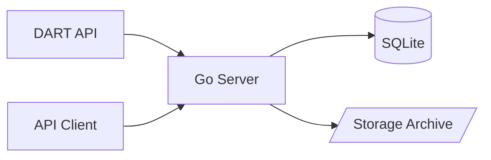

# DART ETL Pipeline

A high-performance ETL pipeline designed to ingest corporate disclosures from the DART (Data Analysis, Retrieval and Transfer System) API in Korea, and expose them via a REST API.

## Architecture

This project uses a **Go-only Architecture**:
- **Go (Backend/Orchestration)**: Handles concurrent I/O, scheduling, database management, and API serving.
- **SQLite**: Local relational database for storing metadata and disclosure details.



---

## 🚀 How to Run

1.  **Configure Environment**: Ensure your `.env` file has valid keys.
    ```env
    DART_API_KEY=your_dart_key
    DB_PATH=dart.db
    STORAGE_DIR=./storage
    ```
2.  **Run Server**:
    ```bash
    go mod tidy
    ./start.sh
    ```
    The server will start on port `8080` in the background. Logs are written to `logs/server.log`.

3.  **Stop Server**:
    ```bash
    ./stop.sh
    ```

---

## � API Documentation

### 1. List Corporations
`GET /api/corps`
- **Query Params**: `page` (default 1), `limit` (default 20)
- **Response**: List of registered corporations.

### 2. List Filings
`GET /api/filings`
- **Query Params**: `page` (default 1), `limit` (default 20)
- **Response**: List of recent filings.

### 3. Get Filing Detail
`GET /api/filings/:rcept_no`
- **Response**: Detailed information about a filing, including downloaded document status.

---

## � ETL Pipeline Design

### **Step 0) Corp Code Collection**
Fetches unique corporation codes from DART and stores them in the `corps` table.
- **Frequency**: Initial run + Weekly updates (`@weekly`).

### **Step 1) Filing List Ingestion**
Fetches recent filing lists and stores them in the `filings` table.
- **Frequency**: Every hour (`@hourly`).
- **Lookback**: Checks past 3 days to ensure data completeness.

### **Step 2) Document Download**
Downloads the original XML/ZIP files for filings.
- **Frequency**: Every 5 minutes (`@every 5m`).
- **Storage**: Files are saved in `./storage` and tracked in `filing_documents`.

---

## 🛠️ Tech Stack
- **Go 1.23+**: Gin (Web Framework), GORM (SQLite), Cron, Resty
- **Database**: SQLite (Local file based)

