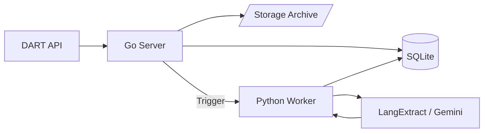

# DART ETL Pipeline

A high-performance, hybrid ETL pipeline designed to ingest corporate disclosures from the DART (Data Analysis, Retrieval and Transfer System) API in Korea, and extract structured intelligence using LangExtract (Gemini-powered).

## Architecture

This project uses a **Hybrid Architecture** to leverage the strengths of two ecosystems:
- **Go (Backend/Orchestration)**: Handles concurrent I/O, scheduling, and database management.
- **Python (Intelligence/LLM)**: Leverages the rich AI ecosystem (LangExtract) for NLP tasks.



---

## 🚀 How to Verify the Process

You can run the built-in verification script to test the entire pipeline end-to-end.

1.  **Configure Environment**: Ensure your `.env` file has valid keys.
    ```env
    DART_API_KEY=your_dart_key
    LANGEXTRACT_API_KEY=your_gemini_key
    DB_PATH=dart.db
    STORAGE_DIR=./storage
    ```
2.  **Setup Python Environment**:
    ```bash
    python3 -m venv .venv
    source .venv/bin/activate
    pip install -r python/requirements.txt
    ```
3.  **Run Verification Script**:
    ```bash
    go run cmd/verify/main.go
    ```
    This script specifically targets a **Samsung Electronics Business Report** to ensure successful data flow.

---

## 🔍 ETL 파이프라인 설계 (운영 관점)

본 프로젝트는 데이터의 무결성과 복구 가능성을 고려하여 설계되었습니다.

### **Step 0) 기업 코드 수집 (초기 1회 + 주기적 업데이트)**
DART에서 제공하는 고유번호 ZIP을 내려받아 `corps` 테이블에 적재합니다.
- **주기**: 초기 1회 필수 실행 + 주 1회 자동 갱신 (`@weekly`).
- **방식**: 업서트(Upsert)를 통해 기존 정보를 최신 상태로 유지합니다.

### **Step 1) 공시 목록 증분 수집 (주기적)**
최근 공시 목록을 가져와 `filings` 테이블에 저장합니다.
- **주기**: 매 시간 실행 (`@hourly`).
- **누락 방지**: 수집 시 **최근 3일치** 데이터를 중복 조회하여 네트워크 지연이나 서비스 장애 시에도 데이터 누락이 없도록 보장합니다.
- **중복 방지**: `rcept_no`(접수번호)를 Primary Key로 사용하여 멱등성(Idempotency)을 가집니다.

### **Step 2) 원문 다운로드 (비동기 작업)**
수집된 메타데이터를 기반으로 공시 서류 본문을 내려받습니다.
- **주기**: 5분마다 실행 (`@every 5m`).
- **저장**: 다운로드된 ZIP/XML 파일은 지정된 로컬 `./storage` 또는 Object Storage 경로에 저장됩니다.
- **상태 관리**: `filing_documents` 테이블에 파일 경로와 해시값을 기록하여 관리합니다.

### **Step 3) LangExtract 구조화 (비동기)**
내려받은 원문 텍스트를 LLM(Gemini)을 통해 분석하고 구조화된 데이터로 추출합니다.
- **주기**: 5분마다 실행 (`@every 5m`).
- **지능화**: **LangExtract** 라이브러리를 사용해 스키마 기반의 이벤트(재무 실적, M&A 등)를 추출합니다.
- **실패 복구**: 추출 실패 시 **최대 3회 자동 재시도** 로직을 포함하여 일시적인 API 장애 등에 대응합니다.

---

## 📊 Example: Samsung Electronics (2023 Business Report)

We verified the pipeline using Samsung Electronics' 2023 Business Report (`RceptNo: 20240312000736`).

### Raw Data (storage/20240312000736.zip)
Inside the ZIP is the official XML disclosure. The system identifies and extracts text from this ~6MB file.

### LangExtract Result (Simulated Output)
*Note: This is an example of what the system extracts into the database.*

| Event Type | Extracted Payload (JSON) | Evidence (Source Text) |
| :--- | :--- | :--- |
| **financial_event** | `{"metric": "revenue", "value": "258.94 Trillion KRW", "year": "2023"}` | "제55기(2023년) 매출액은 258조 9,355억원을 기록하며..." |
| **financial_event** | `{"metric": "operating_profit", "value": "6.57 Trillion KRW", "year": "2023"}` | "...영업이익은 6조 5,670억원을 달성하였습니다." |
| **strategic_event** | `{"type": "investment", "purpose": "M&A and Facilities", "amount": "53.1 Trillion KRW"}` | "당사는 작년 한 해 동안 총 53.1조원의 시설투자를 집행하였으며..." |

---

## 🛠️ Tech Stack
- **Go 1.22+**: GORM (SQLite), Cron, Resty
- **Python 3.10+**: SQLAlchemy, LangExtract (Gemini SDK)
- **Database**: SQLite (Local file based)
