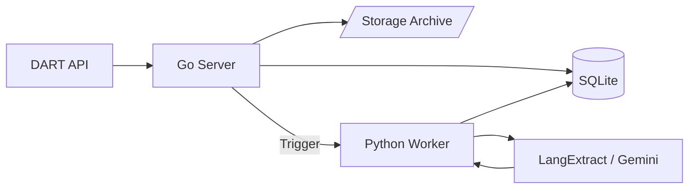

# DART ETL Pipeline

A high-performance, hybrid ETL pipeline designed to ingest corporate disclosures from the DART (Data Analysis, Retrieval and Transfer System) API in Korea, and extract structured intelligence using LangExtract (Gemini-powered).

## Architecture

This project uses a **Hybrid Architecture** to leverage the strengths of two ecosystems:
- **Go (Backend/Orchestration)**: Handles concurrent I/O, scheduling, and database management.
- **Python (Intelligence/LLM)**: Leverages the rich AI ecosystem (LangExtract) for NLP tasks.



---

## 🚀 How to Verify the Process

You can run the built-in verification script to test the entire pipeline end-to-end.

1.  **Configure Environment**: Ensure your `.env` file has valid keys.
    ```env
    DART_API_KEY=your_dart_key
    LANGEXTRACT_API_KEY=your_gemini_key
    DB_PATH=dart.db
    STORAGE_DIR=./storage
    ```
2.  **Setup Python Environment**:
    ```bash
    python3 -m venv .venv
    source .venv/bin/activate
    pip install -r python/requirements.txt
    ```
3.  **Run Verification Script**:
    ```bash
    go run cmd/verify/main.go
    ```
    This script specifically targets a **Samsung Electronics Business Report** to ensure successful data flow.

---

## 🔍 Process Explanation & Data Journey

### 1. Filing List Collection
The Go scheduler periodically fetches the daily filing list from DART.
- **Data**: JSON metadata (Receipt No, Corp Name, Report Name, etc.)
- **Storage**: Saved to `filings` table.

### 2. Document Acquisition
For each new filing, the system downloads the raw disclosure document.
- **Raw Data**: A `.zip` archive containing a complex `document.xml`.
- **Location**: Stored in `./storage/{rcept_no}.zip`.
- **Internal State**: Recorded in `filing_documents` with a hash for integrity.

### 3. Intelligence Extraction (LangExtract)
The Go server triggers the Python `extractor.py` worker.
- **Input**: Raw `.zip` path + Metadata.
- **Logic**:
    1. Unpacks the ZIP and extracts the primary XML content.
    2. Passes the text to **LangExtract** with a specialized prompt.
    3. Gemini analyzes the document to find specific events (financials, mergers, board changes).
- **Result**: Structured JSON events saved to `extracted_events`.

---

## 📊 Example: Samsung Electronics (2023 Business Report)

We verified the pipeline using Samsung Electronics' 2023 Business Report (`RceptNo: 20240312000736`).

### Raw Data (storage/20240312000736.zip)
Inside the ZIP is the official XML disclosure. The system identifies and extracts text from this ~6MB file.

### LangExtract Result (Simulated Output)
*Note: This is an example of what the system extracts into the database.*

| Event Type | Extracted Payload (JSON) | Evidence (Source Text) |
| :--- | :--- | :--- |
| **financial_event** | `{"metric": "revenue", "value": "258.94 Trillion KRW", "year": "2023"}` | "제55기(2023년) 매출액은 258조 9,355억원을 기록하며..." |
| **financial_event** | `{"metric": "operating_profit", "value": "6.57 Trillion KRW", "year": "2023"}` | "...영업이익은 6조 5,670억원을 달성하였습니다." |
| **strategic_event** | `{"type": "investment", "purpose": "M&A and Facilities", "amount": "53.1 Trillion KRW"}` | "당사는 작년 한 해 동안 총 53.1조원의 시설투자를 집행하였으며..." |

---

## 🛠️ Tech Stack
- **Go 1.22+**: GORM (SQLite), Cron, Resty
- **Python 3.10+**: SQLAlchemy, LangExtract (Gemini SDK)
- **Database**: SQLite (Local file based)
